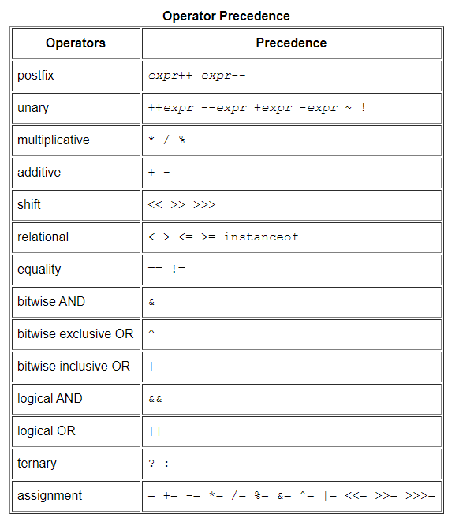

# Java Basics
**java programming language has *8* primitives data types which are:**
1. int (32 bits) stores numbers [ int x = 10000;]
2. long (64 bits) stores numbers that **int** can not store. [ int y = 10000000000;]
3. short (16 bits) stores numbers as well. [ int w = 500;]
4. float (32 bits) stores floating-point numbers [ float x = 1000;]
5. double (64 bits) stores floating-point numbers as well. [ double w = 10.456;]
6. byte (8 bits) stores small numbers from (-127 -> 127) only [ byte b = 100;]
7. char (8 bits) stores characters [ char c = 'A'; ]
8. boolean (1 bit) stores boolean values [ boolean v = true; ]

**naming variables in java programming language:**
java has its rules for naming a variable and they similar to most of the programming languages such as javascript.

* keywords such as for, while, class, if,... etc  can not be used as variable names
* variable names must not have space.
* variable names must not start with a number
* underscore(_) is the only special character allowed in a variable name.
* variables should follow camelCase naming 
* classes always start with capital letters. so that they can be recognized faster.

**Operators in java programming language**
[link to the source](https://docs.oracle.com/javase/tutorial/java/nutsandbolts/operators.html)



**Control Flow Statements in java programming language**

```java
boolean youAreGoodPerson;
if (youReadThis){
    if(youFoundItGood){
      youAreGoodPerson = true;
    }else{
      youAreGoodPerson = false;
    }
}else{
  System.out.println("You really need to start reading");
}
```

blocks such as for and while loops, if and switch affect the flow of the execution of the program.

if a condition has met the if statement will be executed while the else statement will be skipped.

java offers more sense condition comparing methodolgy which is **switch**. Instead of wring too many if-else if statments

switch will do that for you with nice looking and more readable code.

[link to the code below](https://docs.oracle.com/javase/tutorial/java/nutsandbolts/switch.html)

```java
  int month = 8;
  String monthString;
  switch (month) {
      case 1:  monthString = "January";
                break;
      case 2:  monthString = "February";
                break;
      case 3:  monthString = "March";
                break;
      case 4:  monthString = "April";
                break;
      case 5:  monthString = "May";
                break;
      case 6:  monthString = "June";
                break;
      case 7:  monthString = "July";
                break;
      case 8:  monthString = "August";
                break;
      case 9:  monthString = "September";
                break;
      case 10: monthString = "October";
                break;
      case 11: monthString = "November";
                break;
      case 12: monthString = "December";
                break;
      default: monthString = "Invalid month";
                break;
  }
        System.out.println(monthString);
```


