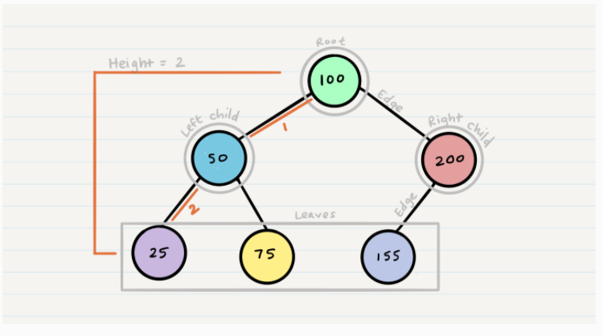
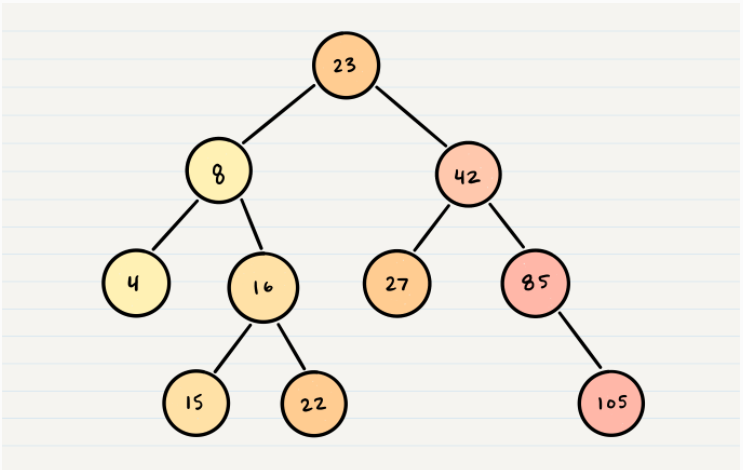

# Tree
A tree is a data structure like Stacks, Queues and LinkedLists

A tree consists of the following:
* Node: tree component that contains a value and a reference to another node
* Root: is the node at the top of the tree
* K: a number the determines how many children a node can have
* Left: (in binary tree) the child node to the left
* Right: (in binary tree) the chid node to the right
* Leaf: the node that does not have any children
* Edge: is the link between a child node and its parent node in the tree.
* Height: the number of edges from the root to the last leaf in the tree.

<h2 style="font-family: cursive; color:red; margin-bottom:20px; margin-top: 50px; font-weight:bold">Simple Tree</h2>

### Binary Search Tree (BST)

for binary search tree the structure of it as follow:
* the left nodes are smaller than the root node
* the right nodes are bigger than the root node

as shown in the image below:

<h2 style="font-family: cursive; color:red; margin-bottom:20px; margin-top: 50px; font-weight:bold">Binary Search Tree</h2>

searching for a value in a binary search tree, done by looping until meet the last leaf and the time complexity is O(height)

the tree heigth(the number of edges between the root and the last leaf)

and the space complexity is O(1) because searching a binary tree does not allocate and extra space.