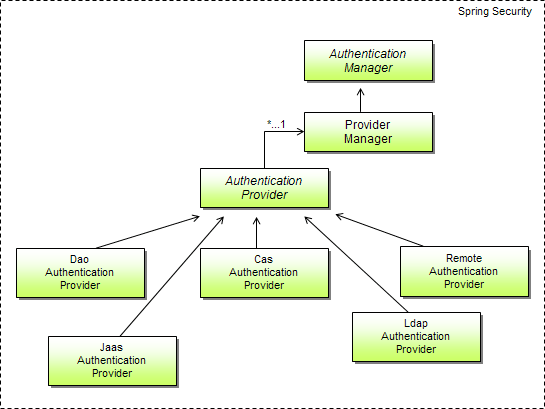

# Spring Authentication

[Authentication](https://economictimes.indiatimes.com/definition/authentication) is the process of recognizing a user’s identity. It is the mechanism of associating an incoming request with a set of identifying credentials. The credentials provided are compared to those on a file in a database of the authorized user’s information on a local operating system or within an authentication server

### Difference between Authentication and Authorization

**Authentication**: mainly Authentication for asking a user, *Who are you*?

**Authorization**: to know what access control a user has, *What are you allowed to do/see*?



as shown in the image above, the main strategy in Spring Authentication is AuthenticationManger intergace which has only one method:

```java
  public interface AuthenticationManager {

  Authentication authenticate(Authentication authentication)
    throws AuthenticationException;
  }
```

According to [Spring-Authentication-Documentation](https://spring.io/guides/topicals/spring-security-architecture/) an AuthenticationManager can do one of 3 things in its authenticate() method:

* Return an Authentication (normally with authenticated=true) if it can verify that the input represents a valid principle.

* Throw an AuthenticationException if it believes that the input represents an invalid principle.

* Return null if it cannot decide.


The most commonly used implementation of AuthenticationManager is ProviderManager, which delegates to a chain of AuthenticationProvider instances. An AuthenticationProvider is a bit like an AuthenticationManager, but it has an extra method to allow the caller to query whether it supports a given Authentication type:

```java
  public interface AuthenticationProvider {

    Authentication authenticate(Authentication authentication)
        throws AuthenticationException;

    boolean supports(Class<?> authentication);
  }
```