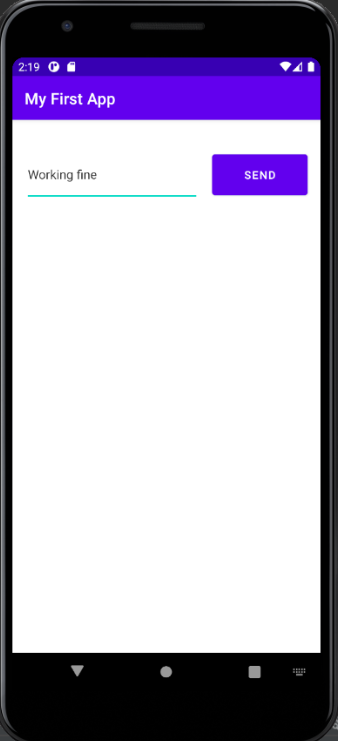

# Android Fundamentals
Java, C++ and Kotlin are the programming languages used to write android applications.

Android Package (**.apk**) is the file that the SDK makes after compling the code written in the previous programming languages.

Android operating system is linux multi-user system in which each app is a different user and the system assigns a unique ID for each app so the files of that app can only be accessible by the app.

Each process has its own virtual machine (VM), so an app's code runs in isolation from other apps.

each app by default has an access to its own files and this done by the android system which gives each app the least privilges, and for apps they can ask for permission such as read/write to the external storage, use the camera, connect to the internet ..etc.

these permissions invoked at the run time, and for the new versoins of android, you can give the permission only when the app is running or only once.

## [App components](https://developer.android.com/guide/components/fundamentals)
App components are the essential building blocks of an Android app. Each component is an entry point through which the system or a user can enter your app. Some components depend on others.

There are four different types of app components:

1. Activities
2. Services
3. Broadcast receivers
4. Content providers

### Activities

  

  
An activity is the entry point for interacting with the user. It represents a single screen with a user interface for example the image on the right, it shows an input field and a button where the user can interact with them, and another activity will be created once the user clicked on the button <i>SEND</i>, this activity will show a text that sent from the main activity.

  

   

  

### Services

A service is a general-purpose entry point, and it has no interface, services are running in the background to perform long-running operations or to perform work for remote processes.

A service may play music in the background or fetch data from the internet without blocking the user interaction with the app.

There are two types of services:

the services the user is aware of, such that service that plays music, even if the user exit the app, and it must show a notificaition to tell the user about the state of the service, the system has to keep this process running.

The other type which is the user does not know about, these processes allow more freedom to deal with, they can be killed and restarted whenever the system need the resource that these services allocate in order to run such ram.

### [Broadcast Receivers](https://developer.android.com/guide/components/fundamentals#broadcast-receiver)
A broadcast receiver is a component that enables the system to deliver events to the app outside of a regular user flow, allowing the app to respond to system-wide broadcast announcements. Because broadcast receivers are another well-defined entry into the app, the system can deliver broadcasts even to apps that aren't currently running.

### [Content Providers](https://developer.android.com/guide/components/fundamentals)

A content provider manages a shared set of app data that you can store in the file system, in an SQLite database, on the web, or on any other persistent storage location that your app can access. Through the content provider, other apps can query or modify the data if the content provider allows it.
