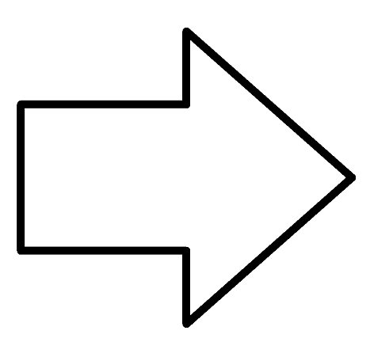
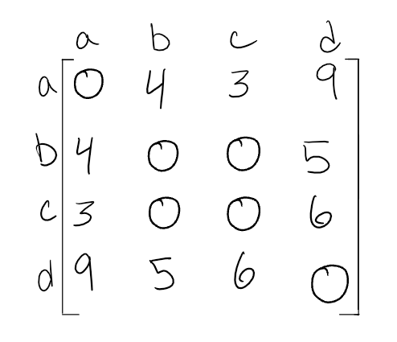

# Graph

A graph is a non-linear data structure that consists of a collection of vertices (nodes).

### Terminology

* **Vertex** or *node* that holds the data and it can have one ore more adjecent vertices
* **Edge** is the connection between two nodes
* **Neighbor** the neighbor of a node are the nodes that connected with it by edge
* **Degree** the number of edges that connected with vertex

### Directed vs Undirected

#### Undirected Graphs
An Undirected Graph is a graph where each edge is undirected or bi-directional. This means that the undirected graph does not move in any direction.

**_Example -> friendship on Facebook, if *a* is friend of *b* then *b* is also friend of *a*_**

#### Directed Graphs

A Directed Graph also called a Digraph is a graph where every edge is directed.

Unlike an undirected graph, a Digraph has direction. Each node is directed at another node with a specific requirement of what node should be referenced next.

**_Example -> followers on Twitter, if *a* follows *b* then *b* not necessarily follows *a*_**

### Complete vs Connected vs Disconnected

#### Complete Graphs

when each vertex connected to all vertices in the graph. As shown in the image below:

#### Connected Graphs

when each vertex has at least on connection with another vertex. As shown in the image below:

#### Disconnected Graphs

when some of the vertices is not connected with others(they have no edges). As shown in the image below:

### Acyclic vs Cyclic

#### Acyclic Graphs

An acyclic graph is a directed graph without cycles.

A cycle is when a node can be traversed through and potentially end up back at itself.

A directed acyclic graph is also called a DAG. This can also be represented as what we know as a **tree**.

As shown in the image below:

#### Cyclic Graphs

A Cyclic graph is a graph that has cycles.

A cycle is defined as a path of a positive length that starts and ends at the same vertex.

As shown in the image below:

### Graph Representation

There are two ways to represent a graph:
1. Adjacency Matrix
2. Adjacency List

#### Adjacency Matrix

2-D array created to represent a graph, each row and column represnts each vertex.

if the node connected with another node 1 is being added, and 0 for no connection between the two nodes.

**sparse** graph is when there are very few connections.

**dense** graph is when there are many connections

#### Adjacency List

An adjacency list is the most common way to represent graphs.

An adjacency list is a collection of linked lists or array that lists all of the other vertices that are connected.

Adjacency lists make it easy to view if one vertices connects to another.

#### Weighted Graphs

A weighted graph is a graph with numbers assigned to its edges. These numbers are called weights

When representing a weighted graph in a matrix, you set the element in the 2D array to represent the actual weight between the two paths. If there is not a connection between the two vertices, you can put a 0, although it is known for some people to put the infinity sign instead.

Within adjacency lists, you must include both the weight and the name of the adjacent vertex.

### Traversals

#### Breadth First Traversal BFT

* it uses queue and set to keep track of visited nodes
* if the graph has islands, they won't be visited

#### Depth First Traversal DFT 

* it uses stack and set to keep track of visited nodes
* if the graph has islands, they won't be visited

### Real World Uses of Graphs
Graphs are extremely popular when it comes to it’s uses. Here are just a few examples of graphs in use:

1. GPS and Mapping
2. Driving Directions
3. Social Networks
4. Airline Traffic
5. Netflix uses graphs for suggestions of products

